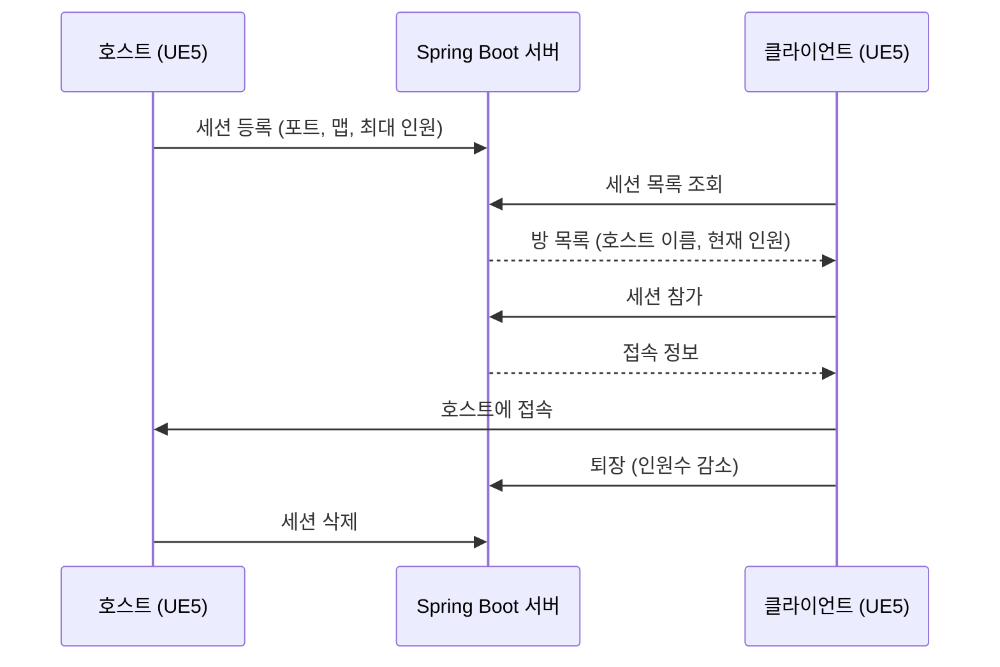

## 🛠 Stack

## ⚙️ WorkFlow

## 🔌 API

| Method | Endpoint | 설명 |
|---|---|---|
| POST | `/api/sessions` | 세션 등록 |
| GET | `/api/sessions` | 세션 목록 조회 |
| POST | `/api/sessions/{id}/join` | 세션 참가 |
| POST | `/api/sessions/{id}/leave` | 세션 퇴장 |
| DELETE | `/api/sessions/{id}` | 세션 삭제 |

## Plan

- [ ] 호스트 비정상 종료 시 남는 방 정리 (하트비트 / 만료 처리)
- [ ] 조건 기반 자동 매칭 (게임모드, 지역, MMR 등)
- [ ] 매칭 대기열을 Redis로 관리해 빠른 조회·삭제
- [ ] 매칭 성립 알림을 WebSocket 푸시로 전달
- [ ] Dedicated Server 할당 방식 결정 (Agones vs 직접 관리)
