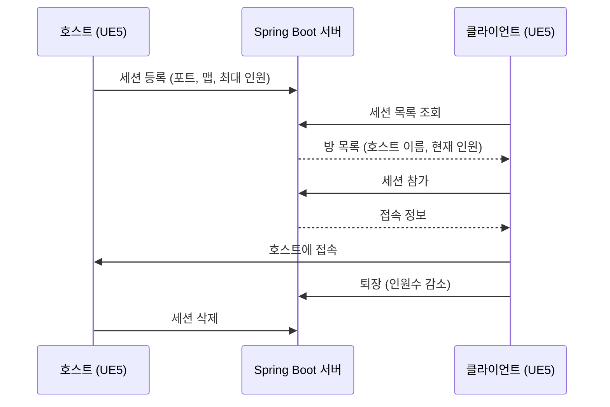

# GameServer

UE5 멀티플레이를 위한 세션 목록 및 매칭 API

호스트의 IP를 직접 입력해야 참가할 수 있던 방식을,
**서버가 방 목록을 관리하고 클라이언트는 목록에서 골라 참가하는 방식**으로 바꾸기 위해 만든 서버이다.

---

## 주요 기능

### 계정(연동보류)
- 회원가입
- 이메일 인증

### 세션(방)
- **방 등록**: 호스트의 로비가 완전히 열리면 `LobbyGameMode`가 자동으로 등록
- **방 목록 조회**: 메인메뉴에서 열려 있는 방을 버튼 목록으로 표시
- **참가 / 퇴장**: 인원수를 서버에서 추적
- **방 삭제**: 호스트가 방을 닫으면 목록에서 제거

---

## ⚙️ WorkFlow

---

## 🔌 API

| Method | Endpoint | 설명 |
|---|---|---|
| POST | `/api/sessions` | 세션 등록 |
| GET | `/api/sessions` | 세션 목록 조회 |
| POST | `/api/sessions/{id}/join` | 세션 참가 |
| POST | `/api/sessions/{id}/leave` | 세션 퇴장 |
| DELETE | `/api/sessions/{id}` | 세션 삭제 |

---

## 🛠 Stack

---

## Plan

- [ ] 호스트 비정상 종료 시 남는 방 정리 (하트비트 / 만료 처리)
- [ ] 조건 기반 자동 매칭 (게임모드, 지역, MMR 등)
- [ ] 매칭 대기열을 Redis로 관리해 빠른 조회·삭제
- [ ] 매칭 성립 알림을 WebSocket 푸시로 전달
- [ ] Dedicated Server 할당 방식 결정 (Agones vs 직접 관리)
